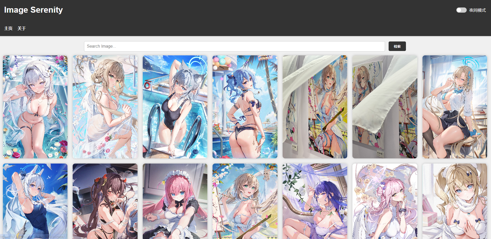
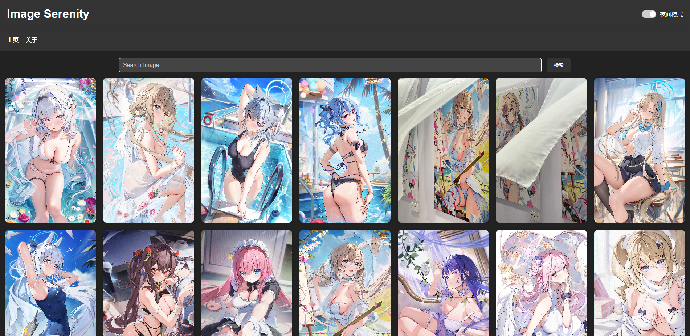
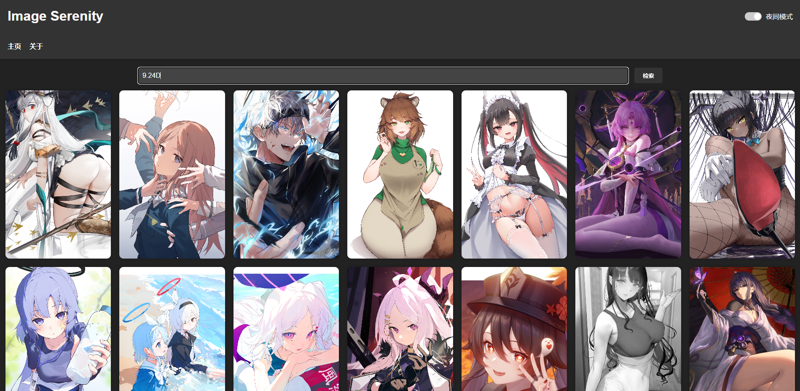
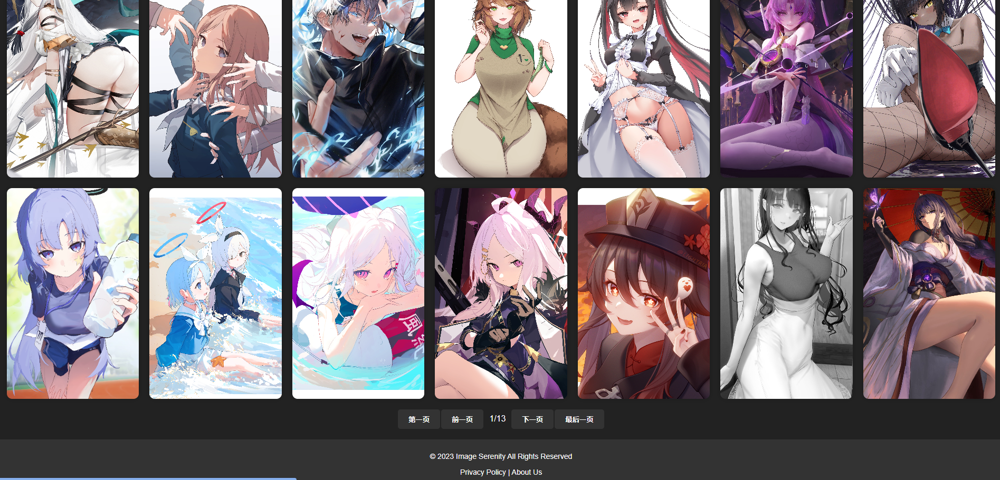
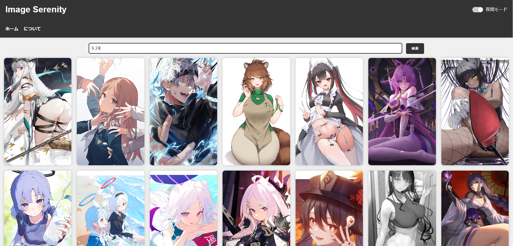

# 哔哩哔哩精选图库（二次元和漫画节选）

English | [简体中文](./README_zh.md) | [日本語](./README_jp.md)

Website URL: https://bilibili-tool.github.io/bilibili-picture

The website currently offers the following features:

- Automatically fetches images from Bilibili UP's featured gallery at scheduled times and saves the retrieved image information to the **./raw/datas.json** file.

- Dynamically displays the image information saved in the **./raw/datas.json** file on the **index.html** page.

  

- Supports both night mode and day mode, allowing users to freely switch between them.

  

- Allows users to click on images to view them in a larger size.

- Provides image search functionality (press Enter to search).

  

- Offers pagination functionality for browsing more images

  

- Supports automatic language switching between Chinese, English, and Japanese based on the user's browser settings.

  

- About and Feedback

  https://twitter.com/Seiriryu
